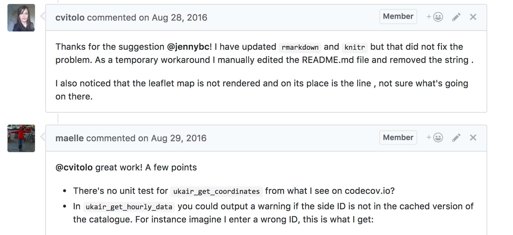

## Esquema

-   Introducción
    -   ¿Por qué esta charla?
    -   Sobre ustedes y sobre mí.
    -   ¿Por qué revisión por pares?
-   Dos componentes cruciales
    -   La forma en que nos comunicamos.
    -   La forma en que construimos y revisamos software.
-   Conclusión
    -   Puntos clave.
    -   Preguntas y comentarios.

- Los materiales están publicados en github.com/maurolepore/ropensci-review
- Estructura: introducción, razones del proceso, dos componentes clave, conclusión
- Habrá tiempo para preguntas al final

# Introducción

## ¿Por qué esta charla?

El proceso es complejo y puede sentirse abrumador.

Esta charla:

-   Destaca los materiales más importantes.
-   Muestra dónde encontrar el resto.
-   Brinda la oportunidad de hacer preguntas.

- El proceso de revisión por pares tiene muchos componentes y puede ser abrumador
- Objetivo: resaltar los materiales más importantes según el rol que desempeñen
- Mostrar dónde encontrar más información cuando la necesiten
- Espacio para aclarar dudas

## Sobre ustedes

-   Pueden querer crear paquetes, hacer una revisión, o participar en el equipo editorial.
-   Tienen curiosidad sobre el proceso de revisión de rOpenSci.

- Audiencia: personas que pueden querer crear paquetes, hacer una revisión, o participar en el equipo editorial
- También personas curiosas sobre cómo funciona el proceso de revisión de rOpenSci
- Las ideas desarrolladas aquí podrían implementarse en otras comunidades

## Sobre mí

-   Desarrollo aplicaciones en R para la medición y pronóstico en marketing.
-   Antes era biólogo.
-   Me uní a rOpenSci en 2018 y he desempeñado diferentes roles.

- Trabajo actual: desarrollo de aplicaciones en R para medición y pronóstico en marketing
- Formación previa como biólogo
- En rOpenSci desde 2018: autor, revisor, editor, editor en jefe, mentor

## [¿Por qué revisión por pares?](https://github.com/ropensci/software-review?tab=readme-ov-file#why-and-how-submit-your-package-to-ropensci)

-   Impulsar la adopción de mejores prácticas y estándares
-   Aumentar la calidad en la cola larga de aplicaciones
-   Construir una comunidad de práctica

- Es un híbrido de revisión de código en ingeniería de software y revisión académica
- Tres razones principales para el proceso
- La construcción de comunidad de práctica fue algo que descubrimos: es tanto necesario como habilitado por el proceso

## Impulsar la adopción de mejores prácticas y estándares

_Algunas citas de quienes crean paquetes y hacen revisiones:_

> "El proceso de revisión me enseñó mucho sobre diferentes herramientas disponibles para hacer mi código más robusto y resistente a cambios futuros."

> "Aprendo mucho al leer detenidamente el código de otras personas y es difícil hacerlo cuando no estoy obligado a revisar tan de cerca."

> "Realmente me encanta el proceso de revisión de paquetes de rOpenSci, especialmente su interactividad y cuánto se puede aprender de otros."

- La mayoría de usuarios/desarrolladores no son ingenieros de software capacitados
- Vienen de contextos científicos y estadísticos
- Desafío: tener una línea base común de mejores prácticas
- Revisión por pares es un mecanismo para aprender sobre buenas prácticas
- La información fluye en ambas direcciones: de revisores a autores y viceversa
- Proceso interactivo vía hilos de GitHub permite aprender juntos
- Énfasis en resiliencia: capacidad de mantenimiento continuo de paquetes

## Aumentar la calidad en la cola larga de aplicaciones

La cola larga: descargas mensuales de todos los paquetes de CRAN

{width=100%}

- Gráfico muestra distribución de descargas de paquetes (datos antiguos pero distribución no ha cambiado)
- Extremo izquierdo: paquetes que todos usan (dplyr, Rcpp)
- Modelo tradicional de código abierto: "muchos ojos encuentran bugs"
- Pero la mayoría de paquetes no tienen muchos usuarios
- No se puede depender del modelo de "muchos ojos" para paquetes pequeños

## Aumentar la calidad en la cola larga de aplicaciones

{width=100%}

- Revisión por pares asegura que al menos 2 personas revisen el código además del autor
- Ejemplo: dbHydro - paquete para base de datos hidrológica de Florida
- Quizás solo 20 usuarios reales, pero muy importante
- Algunos usuarios escribirán reportes para autoridades estatales
- No necesita gran audiencia para ser importante en ciencia/ambiente
- Proceso diseñado para servir paquetes como este

## Construir una comunidad de práctica

> Un grupo de personas que comparten una preocupación, un conjunto de problemas
o una pasión por un tema, y que se reúnen para aprender a hacerlo mejor.

{width=100%}

- Aprendemos mejor juntos en rOpenSci
- A diferencia de revisión anónima en manuscritos académicos
- Usamos enfoque de ingeniería de software: interacción rápida vía GitHub
- Crea vínculos entre personas que generan colaboraciones futuras
- Interacción positiva crea conexiones continuas
- Revisores y autores se conocen como recursos para el futuro

## ¡Esto fue algo accidental!

rOpenSci evolucionó de

 - Un grupo de personas que escribían paquetes de R, a
 - Un grupo de personas que gestionaban muchos paquetes de R, y se dieron cuenta de que necesitaban revisión, a
 - Un grupo de personas que revisaban paquetes de R, y se dieron cuenta de que necesitaban un proceso, a
 - Un grupo de personas que gestionaban un proceso de revisión, y se dieron cuenta de que ***necesitaban una comunidad.***

- rOpenSci comenzó en 2011
- Idea inicial: solo necesitábamos más herramientas para conectar a bases de datos
- Escribíamos paquetes para extraer datos de fuentes de ciencia abierta
- A medida que la colección creció, necesitamos revisar paquetes de personas que no conocíamos
- Luego necesitamos estándares y un proceso formal
- Necesitamos editores para gestionar el proceso de revisión
- Finalmente nos dimos cuenta: lo que construimos y necesitamos es una comunidad
- Jornada: de escribir paquetes → gestionar paquetes → revisar → gestionar revisión → construir comunidad

# Dos componentes cruciales

## Dos componentes cruciales

* La forma en que nos comunicamos: [Código de conducta](https://ropensci.org/code-of-conduct/).

* La forma en que construimos y revisamos software: ["Devguide"](https://devguide.ropensci.org/es/).

> "[Ayudar a mejorar el software] de una manera amable y respetuosa es tan importante como el aspecto técnico".
> -- Yanina Bellini Saibene

- Primer componente: cómo nos comunicamos - documentado en código de conducta
- Segundo componente: cómo construimos y revisamos software - documentado en "dev guide"
- Cita de Yanina enfatiza la importancia de la amabilidad
- Muchas comunidades técnicas no ponen peso suficiente en tratar a otros con amabilidad
- Aquí ponemos énfasis en ambos aspectos: técnico y social
- Quizás 50/50 en importancia

## Ser amables y respetuosos

[Ejemplo de una respuesta amable y respetuosa de quien hace una revisión](https://github.com/ropensci/software-review/issues/577#issuecomment-1494333794).

> ¡Gracias por darme la oportunidad de revisar este paquete genial!
> Me gusta mucho el tamaño corporal de las aves, así que fue agradable
> revisar esto. Creo que el paquete en general es bueno en términos
> de tener un objetivo bien definido, cumplir con ese objetivo y
> documentar cómo se hace. Tengo algunas sugerencias para mejorarlo.
> Si algo necesita aclaración, ¡no duden en contactarme!

[Estableciendo expectativas para la participación en código abierto](https://snarky.ca/setting-expectations-for-open-source-participation/amp/)

> "Incluso cuando alguien ofrece su tiempo como voluntario, hay un costo en su tiempo y esfuerzo."

- Ejemplo de revisión del paquete birth size (issue #577)
- Proceso ocurre en issues del repositorio software-review
- Aspectos de amabilidad en el ejemplo:
  * Comienza reconociendo el privilegio de revisar
  * Menciona interés personal en el tema
  * Da retroalimentación positiva específica antes de sugerencias
  * Ofrece su tiempo para aclaraciones
- Revisión es pública y transparente en GitHub
- No hay anonimato - motiva a ser amable
- Blog post sobre código abierto: tratar contribuciones como actos de amabilidad
- Analogía: es como sostener la puerta para alguien
- Incluso tiempo voluntario tiene costo en tiempo y esfuerzo

## La forma en que construimos y revisamos software

Guías para quienes crean paquetes

-   [Categorías de paquetes dentro del alcance de la revisión de rOpenSci](https://devguide.ropensci.org/es/softwarereview_policies.es.html#package-categories).
-   [Guía de empaquetado](https://devguide.ropensci.org/es/pkg_building.es.html).
-   [Guía para quienes crean paquetes](https://devguide.ropensci.org/es/softwarereview_author.es.html).
-   [Elegir entre diferentes tipos de envío](https://github.com/ropensci/software-review/issues/new/choose).

Otras guías, plantillas y herramientas

-   [Guía para quienes hacen una revisión](https://devguide.ropensci.org/es/softwarereview_reviewer.es.html) y [para el equipo editorial](https://devguide.ropensci.org/es/softwarereview_editor.es.html).
-   [Plantilla de revisión](https://devguide.ropensci.org/es/reviewtemplate.es.html) y [para quien hace la edición](https://devguide.ropensci.org/es/editortemplate.es.html).
-   [Comandos del bot](https://devguide.ropensci.org/es/bot_cheatsheet.es.html).

- Material organizado como progresión natural: alcance → categorías → construir → enviar
- Categorías evolucionan con el tiempo
- Descripciones no siempre son claras - vale la pena discutir con editores
- Guía de empaquetado útil incluso sin enviar a rOpenSci
- Ejemplo: estilo de código reutiliza tidyverse style guide
- Paquete styler automatiza el proceso
- Consistencia en ecosistema facilita transición entre paquetes
- Envío = crear issue en repositorio software-review
- Diferentes sabores: revisión básica, consulta previa, estadística, español
- Plantillas guían el proceso
- Editores ayudan a navegar complejidad
- Comandos del bot (ejemplo: @ropensci-review-bot check package) automatizan verificaciones
- Revisores pueden hacer pull requests pero no es común (80% solo comentarios)

# Conclusión

## Puntos clave

-   Sean amables y respetuosos.
-   El proceso es complejo pero encontrarán mucha ayuda.

- Componente social: ser amables y respetuosos es fundamental
- Componente técnico: proceso puede sentirse abrumador al inicio
- Mucha ayuda disponible en documentación
- Comunidad muy presente en Slack
- Respuestas rápidas y amables a preguntas
- Importante: exponerse gradualmente al proceso
  * Compartir trabajo con amigos/colegas primero
  * Acostumbrarse a dar y recibir retroalimentación
  * Puede ser intimidante exponer creatividad/ideas
  * Retroalimentación viene de forma amable pero aún puede sentirse pesada
  * Programa de campeones ofrece espacios de práctica con mentores y pares
- No hay rechazo en el proceso
  * El ciclo continúa hasta que el paquete está en forma de ser aceptado
  * No es como revisión académica con índices de rechazo
  * Meta: tener el mejor paquete posible para que la gente lo use

## ¿Preguntas y comentarios?

¡Gracias!

Mauro

- Agradecer a Noam y Yanina
- Abrir espacio para preguntas
- Pueden preguntar no solo a mí sino también a Noam y Yanina
- Temas comunes de preguntas:
  * Duración del proceso (6 semanas típicamente, 2-3 meses total)
  * Alcance de paquetes (categorías amplias, programa de campeones tiene flexibilidad)
  * Paquetes pueden estar en múltiples categorías
  * Diferencia entre CRAN y rOpenSci
  * Revisores generalmente comentan pero pueden hacer pull requests
  * Paquetes en español son bienvenidos
  * Publicación académica posible vía Journal of Open Source Software
  * Bioconductor también compatible

